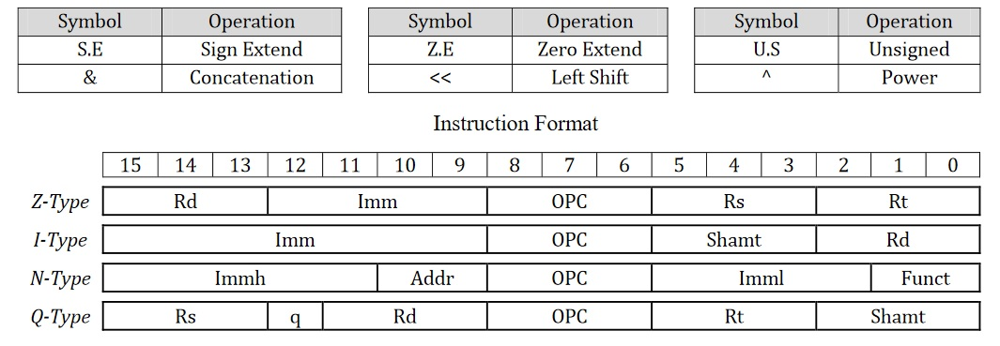
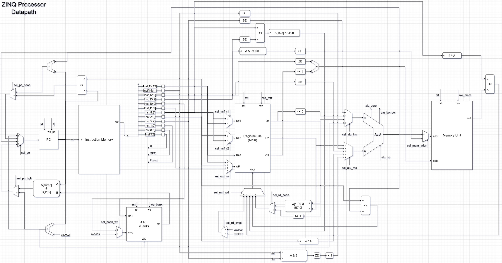
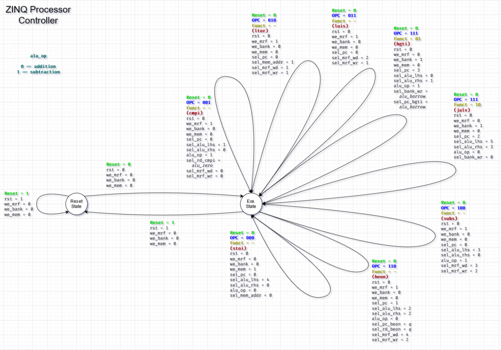

# ZINQ Processor

A simple single-cycle processor designed for educational purposes, written in VHDL.

## Running and Testing

For the simulation process, the supported method is to use [Parvaj](https://github.com/machitgarha/parvaj) (which makes use of GHDL and GtkWave). You can also use well-known possibly-commercial tools (like Xilinx ISE), but you're completely on your own.

First, clone the project with all its dependencies:

```
git clone https://github.com/Kiarash-Parvizi/ZINQ-Processor --recursive
```

Now, you need to initialize Parvaj. Install the requirements specified [here](https://github.com/machitgarha/parvaj#requirements), and then do the following:

```
composer install -d scripts/parvaj/
```

Everything is ready. Deep dive into simulating the project:

```
./scripts/parvaj/bin/parvaj simulate test_main
```

Boom! You can now see a simulation of the processor. Dig into the source code and learn more!

### Testing Other Entities

Almost all entities are well-tested and for each, a unit-test (i.e. test-bench) is written. Feel free to simulate those tests as well.

For instance, if you want to test the controller alone, run:

```
./scripts/parvaj/bin/parvaj simulate test_controller
```

**Note:** The process should work on all Linux distributions, and other Unix variants. Windows users might be able to simulate as well, however it's not guaranteed.

## instruction-set
| type | OPC | funct | assembly-format | Operation |
| :--: | :-: | :---: | :-------------: | :------- |
| Z | 000 | ‐ | stoi Rd, Rs, Rt, Imm | Mem[Rs + Rt] ← 16×U.S(Rd) + Z.E(Imm) |
| Z | 001 | - | cmpi Rd, Rs, Rt, Imm | If (Rs == S.E(Imm))<br/>&nbsp;&nbsp;Rd ← 0x"FFFF"<br/>Else<br/>&nbsp;&nbsp;Rd ← 0x"0000"
| I | 010 | ‐ | ltor Rd, Imm, Shamt  | Rd ← (Mem[S.E(Imm & “0000”)) << (4 ^ Shamt))
| I | 011 | - | luis Rd, Imm, Shamt  | Rd ← (S.E(Imm) << Shamt )[15:8] & 0x"00"
| N | 111 | 01| bgti Imml, Immh, Addr | If (S.E(Imml) < S.E(Immh))<br/>&nbsp;&nbsp;PC ← (PC[15:12] & Bank[Addr][11:0])<br/>&nbsp;&nbsp;Bank[3] ← (PC + 2)<br/>Else<br/>&nbsp;&nbsp;PC ← (PC + 2)<br/>&nbsp;&nbsp;Bank[Addr] ← (PC + 2) |
| N | 111 | 10 | jalv Imml, Immh, Addr | PC ← (Z.E(Immh & Imml)<<1) + (PC + 2)<br/>Bank[Addr] ← (PC+2) |
| Q | 100 | - | subs Rd, Rs, Rt, Shamt | If (q == 1)<br/>&nbsp;&nbsp;Rd ← (Rs ‐ Rt) << Shamt<br/>Else<br/>&nbsp;&nbsp;Rd ← (U.S(Rs) ‐ U.S(Rt)) << Shamt |
Q | 110 | - | beon Rd, Rs, Rt, Shamt | If (q == 1)<br/>&nbsp;&nbsp;Rd ← Rs[15:8] & Rt[7:0]<br/>&nbsp;&nbsp;PC ← PC + ((Rs × 64) + (4 ^ Shamt))<br/>Else<br/>&nbsp;&nbsp;Rd ← NOT(Rs) <br/>&nbsp;&nbsp;PC ← (PC << Shamt) |

## instruction-format


## data-path:


## controller:

