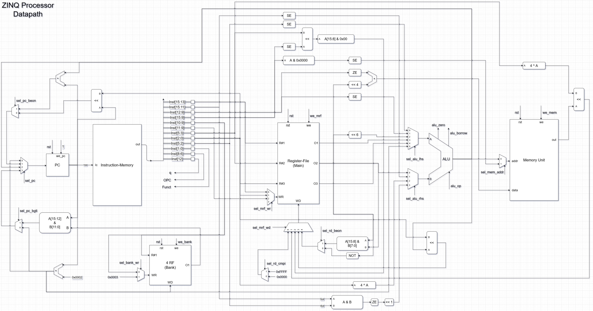

# ZINQ Processor

A simple single-cycle 16-bit processor designed for educational purposes. Written in VHDL.

## Running and Testing

For the simulation process, the supported method is to use [Parvaj](https://github.com/machitgarha/parvaj) (which makes use of GHDL and GtkWave). You can also use well-known possibly-commercial tools (like Xilinx ISE), but you're completely on your own.

First, clone the project with all its dependencies:

```
git clone https://github.com/Kiarash-Parvizi/ZINQ-Processor --recursive
```

Now, you need to initialize Parvaj. Install the requirements specified [here](https://github.com/machitgarha/parvaj#requirements), and then do the following:

```
composer install -d scripts/parvaj/
```

Everything is ready. Deep dive into simulating the project:

```
./scripts/parvaj/bin/parvaj simulate test_main
```

Boom! You can now see a simulation of the processor. Dig into the source code and learn more!

### Testing Other Entities

Almost all entities are well-tested and for each, a unit-test (i.e. test-bench) is written. Feel free to simulate those tests as well.

For instance, if you want to test the controller alone, run:

```
./scripts/parvaj/bin/parvaj simulate test_controller
```

**Note:** The process should work on all Linux distributions, and other Unix variants. Windows users might be able to simulate as well, however it's not guaranteed.

## The Design

Every processor has an [instruction set](https://en.wikipedia.org/wiki/Instruction_set_architecture) and instructions format (defined as layout of bits of instructions). These two defines what the processor features and how it can be used (e.g. by a compiler). However, these are only definitions, and they have to be actually implemented.

In a simple realization, ZINQ processor divides into two separated but connected [datapath](https://en.wikipedia.org/wiki/Datapath) and [controller](https://whatis.techtarget.com/definition/controller) entities. They are first designed conceptually and visually, and then implemented in VHDL, making the design process simple.

In the datapath, we have two register files named as Main and Bank. The main has 8 registers and the bank has 4.

Keep going for more details.

### Instructions Format

ZINQ processor has four types of instructions, Z-type, I-type, N-type and Q-type. Each type has a unique format shown in the table below.

<table>
    <tr>
        <td></td>
        <td>15</td>
        <td>14</td>
        <td>13</td>
        <td>12</td>
        <td>11</td>
        <td>10</td>
        <td>9</td>
        <td>8</td>
        <td>7</td>
        <td>6</td>
        <td>5</td>
        <td>4</td>
        <td>3</td>
        <td>2</td>
        <td>1</td>
        <td>0</td>
    </tr>
    <tr>
        <td>Z-Type</td>
        <td colspan="3" align="center">Rd</td>
        <td colspan="4" align="center">Imm</td>
        <td colspan="3" align="center">OPC</td>
        <td colspan="3" align="center">Rs</td>
        <td colspan="3" align="center">Rt</td>
    </tr>
    <tr>
        <td>I-Type</td>
        <td colspan="7" align="center">Imm</td>
        <td colspan="3" align="center">OPC</td>
        <td colspan="3" align="center">Shamt</td>
        <td colspan="3" align="center">Rd</td>
    </tr>
    <tr>
        <td>N-Type</td>
        <td colspan="5" align="center">Immh</td>
        <td colspan="2" align="center">Addr</td>
        <td colspan="3" align="center">OPC</td>
        <td colspan="4" align="center">Imml</td>
        <td colspan="2" align="center">Funct</td>
    </tr>
    <tr>
        <td>Q-Type</td>
        <td colspan="3" align="center">Rs</td>
        <td colspan="1" align="center">q</td>
        <td colspan="3" align="center">Rd</td>
        <td colspan="3" align="center">OPC</td>
        <td colspan="3" align="center">Rt</td>
        <td colspan="3" align="center">Shamt</td>
    </tr>
</table>

#### Fields Explanations

-   OPC and Funct: Operation of the instruction. Specifies which instruction is it, along with its type (e.g. Z-type) to extract other fields.

-   R* and Addr: The number of a register, in which its value is used when referenced. The first one is for the main register file, the second is for the bank one.

-   Imm*: A constant value. Stands for immediate.

-   Shamt: Shift amount used in dynamic shift operations.

For more details, see the Instruction Set section below.

### Instruction Set

| Type | OPC | Funct | Assembly Format | Operation |
| :--: | :-: | :---: | :-------------: | :------- |
| Z | 000 | ‐ | `stoi Rd, Rs, Rt, Imm` | Mem[Rs + Rt] ← 16×U.S(Rd) + Z.E(Imm) |
| Z | 001 | - | `cmpi Rd, Rs, Rt, Imm` | If (Rs == S.E(Imm))<br/>&nbsp;&nbsp;Rd ← 0x"FFFF"<br/>Else<br/>&nbsp;&nbsp;Rd ← 0x"0000"
| I | 010 | ‐ | `ltor Rd, Imm, Shamt` | Rd ← (Mem[S.E(Imm & “0000”)) << (4 ^ Shamt))
| I | 011 | - | `luis Rd, Imm, Shamt` | Rd ← (S.E(Imm) << Shamt )[15:8] & 0x"00"
| N | 111 | 01 | `bgti Imml, Immh, Addr` | If (S.E(Imml) < S.E(Immh))<br/>&nbsp;&nbsp;PC ← (PC[15:12] & Bank[Addr][11:0])<br/>&nbsp;&nbsp;Bank[3] ← (PC + 2)<br/>Else<br/>&nbsp;&nbsp;PC ← (PC + 2)<br/>&nbsp;&nbsp;Bank[Addr] ← (PC + 2) |
| N | 111 | 10 | `jalv Imml, Immh, Addr` | PC ← (Z.E(Immh & Imml)<<1) + (PC + 2)<br/>Bank[Addr] ← (PC+2) |
| Q | 100 | - | `subs Rd, Rs, Rt, Shamt` | If (q == 1)<br/>&nbsp;&nbsp;Rd ← (Rs ‐ Rt) << Shamt<br/>Else<br/>&nbsp;&nbsp;Rd ← (U.S(Rs) ‐ U.S(Rt)) << Shamt |
Q | 110 | - | `beon Rd, Rs, Rt, Shamt` | If (q == 1)<br/>&nbsp;&nbsp;Rd ← Rs[15:8] & Rt[7:0]<br/>&nbsp;&nbsp;PC ← PC + ((Rs × 64) + (4 ^ Shamt))<br/>Else<br/>&nbsp;&nbsp;Rd ← NOT(Rs) <br/>&nbsp;&nbsp;PC ← (PC << Shamt) |

#### Operations Explained

-   S.E: Sign Extend
-   Z.E: Zero Extend
-   U.S: Unsigned
-   &: Concatenation
-   <<: Left Shift
-   ^: Power (i.e. Exponentiation)

### Datapath



### Controller

The controller is an FSM (Final State Machine).


### Other Resources

If you want to know how the connection signals between datapath and controller are implemented and optimized, see [this image](./about/single-cycle/exe-state-calc).

## License

Licensed under [GPLv3](./LICENSE.md).
